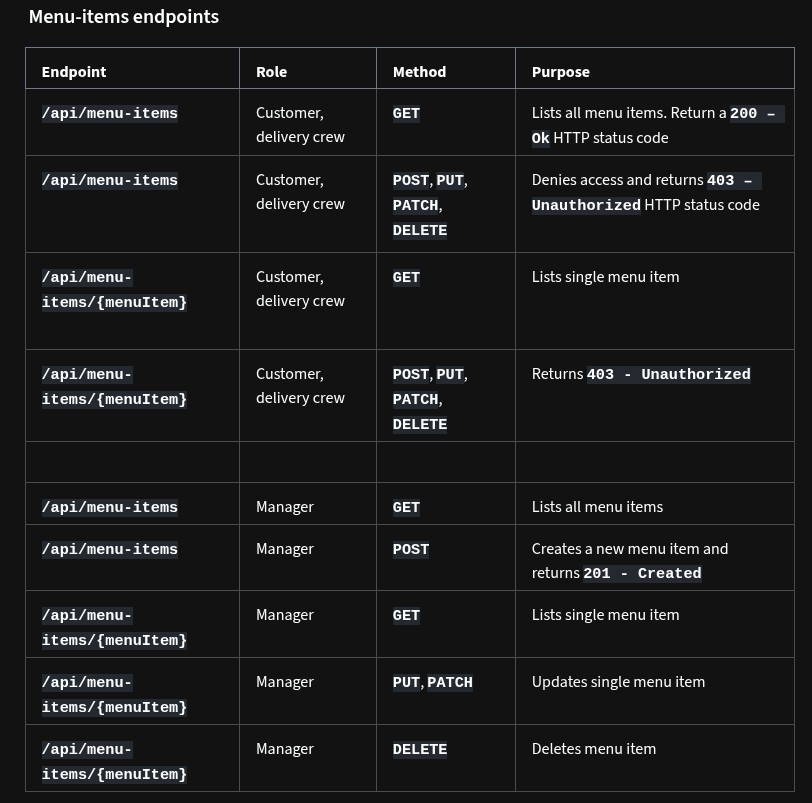
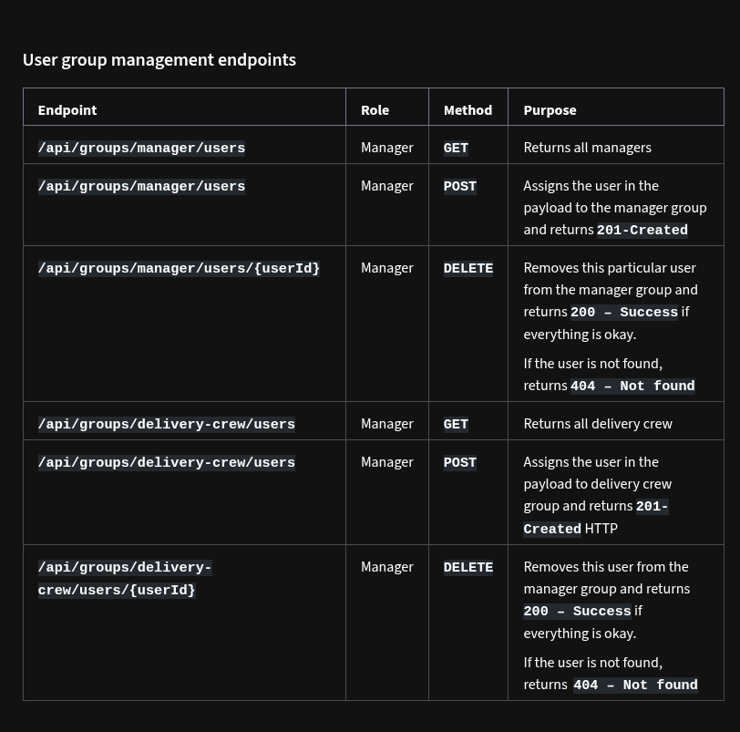
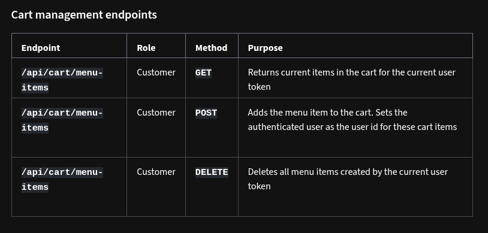
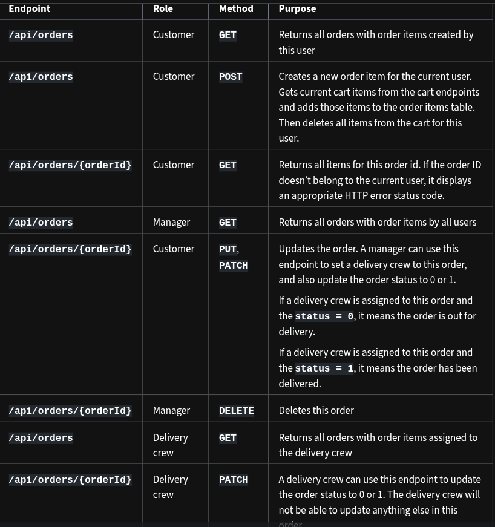

# Project structure and API routes
## scope:
- People with different roles will be able to browse, add and edit menu items, place orders, browse orders, assign delivery crew to orders and finally deliver the orders. 
## User Groups:
- Create the following two user groups and then create some random users and assign them to these groups from the Django admin panel. 
  - manager
  - Delivery Crew
- Users not assigned to a group will be considered customers.
## Error check and proper status codes
- You are required to display error messages with appropriate HTTP status codes for specific errors. These include when someone requests a non-existing item, makes unauthorized API requests, or sends invalid data in a POST, PUT or PATCH request.
## API endpoints:
- Here are all the required API routes for this project grouped into several categories.
### User registration and token generation endpoints 
- You can use Djoser in your project to automatically create the following endpoints and functionalities for you.
- `api/users`, method:`POST` :Creates a new user with name, email and password
- `api/users/user/me`, method:`GET` : Anyone with a valid user token can access the current user details
- `token/login`, method: `POST` : Anyone with a valid username and password Generates access tokens that can be used in other API calls in this project
- When you include Djoser endpoints, Djoser will create other useful endpoints
###  Menu-items endpoints

### User group management endpoints

### Cart management endpoints 

### Order management endpoints

### Implement additional scopes
- Implement proper filtering, pagination and sorting capabilities for /api/menu-items and /api/orders endpoints.
- Finally, apply some throttling for the authenticated users and anonymous or unauthenticated users.